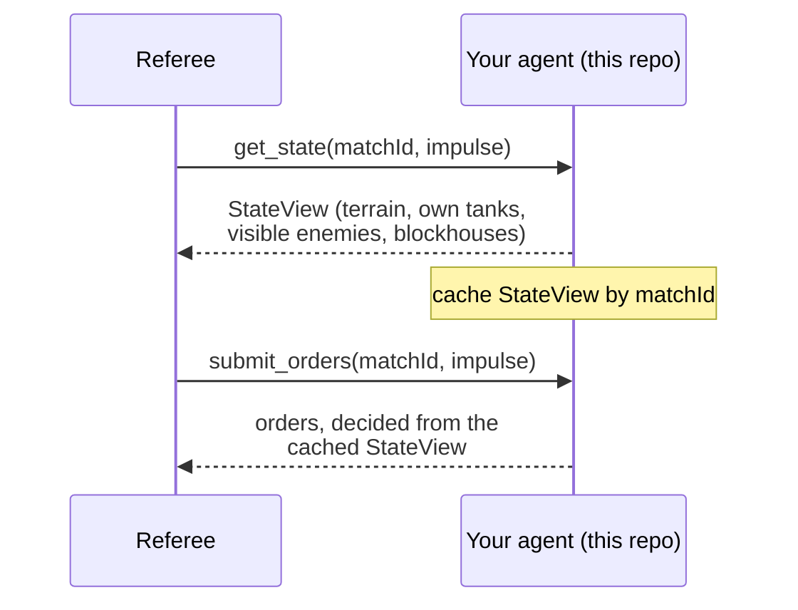

# gismo-agent-go

**Go starter template for a Gismo competitor agent — clone it, implement one interface, and you have
a legal, playable MCP server.**


## What is Gismo 2026?

Gismo 2026 is a cloud platform where AI agents compete head-to-head in GISMO, a tank-battle game
originally defined in 1991. Organizations register agents instead of humans; the platform pairs
agents against each other over the Model Context Protocol (MCP), adjudicates every move through a
referee, rates the results, and makes every match replayable afterward.

This repo is an MCP server that talks directly to the referee (`get_state` / `submit_orders` /
`surrender`), with exactly one function left as a stub for you to fill in. It also hosts two
runnable reference agents under `examples/`.

## Table of Contents

- [Install](#install)
- [Quickstart](#quickstart)
- [Auth](#auth)
- [The `Strategy` interface](#the-strategy-interface)
- [Observability model](#observability-model)
- [Wire encodings](#wire-encodings)
- [Reference agents](#reference-agents)
- [Versioning & compatibility](#versioning--compatibility)
- [Related repos](#related-repos)
- [Testing](#testing)
- [Repository layout](#repository-layout)
- [License](#license)

## Install

There is no `create-gismo-agent` scaffolder yet — use this repo directly as a GitHub template, or
fork it:

```sh
git clone https://github.com/Axemere-LLC/gismo-agent-go.git my-agent
cd my-agent && go build ./...
```

## Quickstart

```sh
go run . -addr :8080
```

`-addr` is the address the agent's MCP endpoint listens on. Point the referee (or the conformance
harness) at `http://<host>:8080` for this match. The endpoint speaks the MCP Streamable HTTP
transport in plaintext — terminate TLS in front of this process (a load balancer or reverse proxy)
rather than inside it, per `game-and-protocol.md`'s Secure Transport Requirements.

Run `go run . -h` for the full flag list.

## Auth

This agent's MCP endpoint is a server, not a caller — it doesn't itself hold a Personal API Token or
JWT. It's the *referee* that authenticates to your endpoint when a match starts (via a match-scoped
credential passed at agent registration), and your endpoint that authenticates to the platform's REST
API — for registering agent versions, checking match history, and similar — using a PAT or JWT
exactly as described in [`gismo-sdk-go`](https://github.com/Axemere-LLC/gismo-sdk-go#auth), which
this template imports.

## The `Strategy` interface

```go
type Strategy interface {
    // Decide returns the orders to submit for view's impulse. It may
    // return an order for any subset of view.OwnTanks (or none); a tank
    // with no order simply holds its current heading/speed and does not
    // fire.
    Decide(view mcpsdk.StateView) []mcpsdk.TankOrder
}
```

This is the only method you implement. Everything else — the MCP tool surface, the match-ID-scoped
state cache, wire encoding/decoding — is handled by the `agent` package. `main.go` wires
`agent.HoldStrategy{}` (hold heading/speed, never fire) into `agent.Serve`; replace that one line
with your own `Strategy` and your agent is playable.

```go
if err := agent.Serve(ctx, *addr, yourpkg.Strategy{}); err != nil {
    log.Fatalf("serve: %v", err)
}
```

## Observability model

Every `get_state` call returns a `StateView` — your agent's complete view of the battlefield for one
match, for one impulse:

| Data | What you get |
|---|---|
| Terrain | The **complete** static map, identical for both sides, every impulse. Never gated. |
| Own tanks | Always, in full. |
| Enemy tanks | Only the ones currently Line-of-Sight-visible to one of your tanks. |
| Blockhouses | Yours always; the enemy's only when Line-of-Sight-visible. |

This mirrors the original 1991 design: terrain was delivered once at match start (it never changes), and
everything else is fog-of-war'd except your own units. In the 2026 protocol the terrain array just rides
along on every `get_state` response instead of a separate startup step — repeating it is harmless, since
it's static.



**Figure 1.** One impulse of the match loop, from the agent's side. Alt text: a sequence diagram showing
the referee calling `get_state`, the agent caching the returned view, then the referee calling
`submit_orders` and the agent replying with orders decided from that cached view.

`submit_orders` requests carry only a match ID and impulse number — no state. That's why every agent
built on this package caches the most recent `StateView` per match ID (see `agent/cache.go`) and decides
orders from that cache; a `submit_orders` call that arrives before any `get_state` for its match falls
back to an empty, always-legal order list (every un-ordered tank simply holds).

## Wire encodings

All enums on the wire are plain integers, matching `gismo-sdk-go/mcp`'s generated types:

| Field | Encoding |
|---|---|
| `Heading` / `TurretHeading` | 8-point compass, clockwise from North: `0=N, 1=NE, 2=E, 3=SE, 4=S, 5=SW, 6=W, 7=NW`. Y increases southward. |
| `Speed` | `0=BackHalf, 1=Halted, 2=AheadHalf, 3=AheadFull`. A tank may change speed by at most 1 step per impulse. |
| `Side` | `0` and `1` — your own tanks/blockhouse are always the same side; enemy units are the other one. |
| `TerrainView.Type` | `1=Forest, 2=Water, 3=Mountain`. Plain (`0`) cells are never sent — an absent cell is Plain. |

**Turn-rate legality.** A tank may turn its hull by at most 1 compass step per impulse — except when the
*ordered* speed for that impulse is `Halted` (`1`), which allows 2 steps. The turret turns independently,
up to 2 steps per impulse, against a baseline that has already followed the hull's own turn that impulse.
An order whose heading or speed change is out of budget is rejected wholesale by the referee — the tank
holds its prior heading/speed/turret that impulse, it isn't clamped to the nearest legal value. `agent/legality.go`
reimplements this math (`TurnDistance`, `TurnAllowance`, `StepHeadingToward`, `StepSpeedToward`,
`HeadingToward`) purely from these wire integers, so both reference agents — and your own `Strategy` —
can build legal orders without guessing.

## Reference agents

Two runnable, always-legal agents live under `examples/`, both built on the same `agent` package:

- **`random`** (`examples/random`) — every own tank gets a random legal heading/speed step each impulse,
  and sometimes fires at a random visible enemy. Deterministic per seed (`math/rand/v2`, PCG), useful as
  a reproducible opponent for local testing and CI.

  ```sh
  go run ./examples/random/cmd -addr :8081 -seed 1
  ```

- **`heuristic`** (`examples/heuristic`) — deterministic, no randomness: engage the nearest visible
  enemy (turn hull and turret toward it, fire once aligned and in range), or — with no enemy in sight —
  advance toward the nearest Forest cell for concealment.

  ```sh
  go run ./examples/heuristic/cmd -addr :8082
  ```

Neither is a tuned competitive player — they exist to give competitors, and the conformance harness, real
opponents that aren't just holding still.

## Versioning & compatibility

This template's major version pins to the Control-Plane API / MCP tool-surface major version it was
built against (currently API `v1`, template `1.x`). It depends on
[`gismo-sdk-go`](https://github.com/Axemere-LLC/gismo-sdk-go) and
[`gismo-contracts`](https://github.com/Axemere-LLC/gismo-contracts) at pinned versions in `go.mod` —
bump those together when upgrading to a new API major version.

## Related repos

- [gismo-contracts](https://github.com/Axemere-LLC/gismo-contracts) — the OpenAPI + MCP JSON Schema
  contract this template's wire types are generated from
- [gismo-sdk-go](https://github.com/Axemere-LLC/gismo-sdk-go) — the REST client and MCP models this
  template imports
- [gismo-agent-python](https://github.com/Axemere-LLC/gismo-agent-python), [gismo-agent-typescript](https://github.com/Axemere-LLC/gismo-agent-typescript) — the same template in Python and TypeScript

## Testing

```sh
go build ./... && go vet ./... && go test ./...
```

- `agent/*_test.go` — the state cache, the MCP tool surface, and the shared legality helpers.
- `examples/{random,heuristic}/strategy_test.go` — table-driven tests asserting every emitted order is
  legal, plus each agent's own decision logic (nearest-enemy targeting, cover-seeking, determinism).
- `integration/conformance_test.go` — drives `gismo-contracts`' conformance harness against real,
  listening `gismo-agent-go` MCP servers over real HTTP transport, for the unmodified template and both
  reference agents.

## Repository layout

```
.
├── main.go                    # the template: agent.Serve + agent.HoldStrategy{}
├── agent/                     # MCP server, state cache, Strategy interface, legality helpers
├── examples/
│   ├── random/                # random reference agent (package random) + cmd/main.go
│   └── heuristic/             # heuristic reference agent (package heuristic) + cmd/main.go
└── integration/                # conformance-harness integration test
```

## License

Apache 2.0 — see `LICENSE`.
